<div style="text-align:center;">
    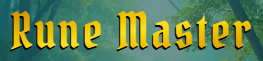
</div>

---
# <u>MP2 - About the project</u>
### **Presentation of interactive data**

In this project, I'll build an interactive front-end site. The site should respond to the users' actions, allowing users to actively engage with data, alter the way the site displays the information to achieve their preferred goals.

### **Value provided:**

1. Users are able to interact with the site in their particular way, to achieve their personal goals and derive answers to their specific questions.

2. The site owner advances their own goals by providing this functionality, potentially by being a regular user themselves.

#### Project Idea

I have decided to create a word guessing game called "Rune Master!", not too dissimilar from something like Wordle, but with a woodland pagan rune theme.

## Project Requirements

### **Main Technologies**

- **Required**: HTML, CSS, JavaScript.

    **Optional**: jQuery or any other JavaScript libraries, external APIs.

- **Chosen Tech Stack** 
    + **Vite**: Built with Vite because of its speed and the fact its a single page app
    + **React**: For it's plug and play feel and performance
    + **TypeScript**: For its more explicit nature and ability to present obvious errors, I like the fact its JavaScript with extra features, I felt like i had more tools at my finger tips
    + **Tailwind CSS**: For speedy utility classes 
    + **Vitest**: For my automation testing because it requires less setup than JEST and better compatibility when using Vite
    + **ESLint**: For linting I opted for ESLint over JSHint due to the requirement for more depth in error analysis, JSHint is also a deprecated feature in VSCode and ESLint is a more industry-wide accepted and utilised linter

### **Mandatory Requirements**

A project violating any of these requirements will FAIL

1. **Dynamic Front End Project**: Write custom JavaScript, HTML and CSS code to create a front-end web application consisting of one or more HTML pages with significant interactive functionality.

2. **Site Responses**: Use JavaScript to have the site produce relevant responses dependent on users' actions.

3. **Information Architecture**: Incorporate a main navigation menu (unless irrelevant) and structured layout (you might want to use Bootstrap to accomplish this).

4. **Documentation**: Write a README markdown file for your project that explains what the project does and the value that it provides to its users.

5. **Version Control**: Use Git & GitHub for version control.

6. **Attribution**: Maintain clear separation between code written by you and code from external sources (e.g. libraries or tutorials). Attribute any code from external sources to its source via comments above the code and (for larger dependencies) in the README.

7. **Deployment**: Deploy the final version of your code to a hosting platform such as GitHub Pages.
---
# <u>Project Documentation</u>

## User Stories

#### As a regular user, I want to be able to view a menu and see the game and content easily, so that I don't feel overwhelmed. - MUST HAVE
- The page should contain a header menu, a body and footer
- The menu should contain links to "rules" icon and "new game" icon
- The footer should contain social links
- The main body of the page should contain the tile board and Keyboard
#### As someone who doesn't play a lot of games, I want to be able to view a set of rules, so that I know how to play the game properly. - MUST HAVE
- The rules icon in the menu should link to the rules modal
- The modal should display the runes meanings and the aim of the game
#### As someone with a short attention span, I want to see quick responses, colours and sounds, so that it will hold my attention and make the game more fun to play. - SHOULD HAVE
- Should have type animations as user types or clicks the word, like a pop or flash
- Letters should colour certain colours depending on whether they are in the wrong position, correct or not in the word
- There should be flip animations for correct letters
- If the user correctly guesses the word the game signifies that the user has won
- If the user runs out of tries the tiles should flip over and show they have lost and return to the initial difficulty choice state
#### As a Mobile and Laptop user, I want to the game to adapt to the device I am playing on, so that I can play while on the go and also when relaxing at home. - MUST HAVE
- The page should be responsive and accommodate all major device widths
- The menu should be responsive and accommodate all major device widths
- The tiles and keyboard should be responsive and accommodate all major device widths
#### As a word game enthusiast, I want to choose the difficulty level, so that I can challenge myself, but also make it more relaxed if I see fit. - COULD HAVE - Coming in a later phase
- The initial state of the game should allow users to choose the difficulty, Easy, Medium, Hard
- The levels should equate to the following modes, Easy - to be a 3 letter word with 10 tries, Medium - to be a 5 letter word with 8 tries and Hard - to be a 7 letter word with 5 tries
#### As a person who isn't great with words, I would like the ability to choose from a few lifeline functions, so that when I am stuck I can get hints or letter reveals. - COULD HAVE - Coming in a later phase
- An icon should be available at the bottom of the tile board allowing users to reveal 1 word for less points
- An icon should be available to allow user to reveal the whole word, but will receive no points
#### As an avid mobile and browser gamer, I want to be able to earn achievements and rewards for hitting milestones and winning games. - COULD HAVE - Coming in a later phase
- Achievements should be accessible via the menu and display as a modal
- Badges etc should be accessible via the menu and display as a modal

# <u>Project Setup</u>

### **Setting up and importing, the project, file structure, styles and testing frameworks and libraries**

[**Vite + ReactJS Application Setup**](https://vite.dev/guide/#scaffolding-your-first-vite-project)<br>
View this particular part of the documentation to see how I setup my project.

[**Tailwind CSS Setup and Import**](https://tailwindcss.com/docs/installation/using-vite)<br>
View this particular part of the documentation to see how setup and import Tailwind into my project.

[**React Icon Import**](https://react-icons.github.io/react-icons/)<br>
View this particular part of the documentation to see how I installed and imported react icons.

[**Vitest Setup**](https://vitest.dev/guide/#adding-vitest-to-your-project)<br>
View this particular part of the documentation to see how I setup my automated testing using Vitest.

## Background Style and Imagery

All images apart from the icons were generated using adobe's AI image generator - Firefly.

### Background

A pagan woodland background with a fantastical theme. Paired with the runes, it achieves the pagan/medieval look and feel.

<div style="text-align:center;">
    
</div>

### Rune Images

Runes of ivory and gold, along with parchment add to the pagan feel, giving a mystical and hero like vibe for the user.

<div style="text-align:center;">
    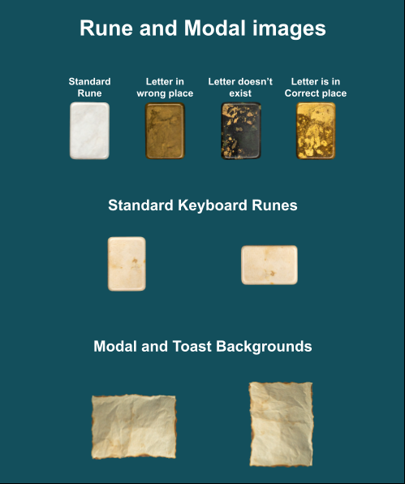
</div>

## Colour Palette

The overall colour theme, while on the surface isn't 100% complimentary, weirdly serves the theme well.

<div style="text-align:center;">
    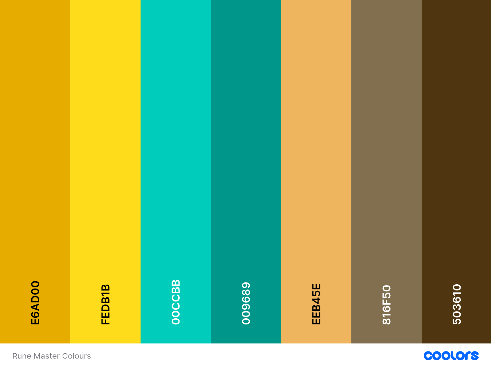
</div>

## Typography

### Primary

<div style="text-align:center;">
    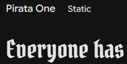
</div>

[**Pirata One - Google Fonts**](https://fonts.google.com/specimen/Pirata+One)

Pirata One is a gothic Textura font, simplified and optimized to work well on screen and pixel displays. Its condensed structure and spacing give the perfect medieval feel.

### Secondary

<div style="text-align:center;">
    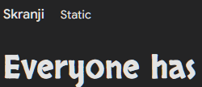
</div>

[**Skranji - Google Fonts**](https://fonts.google.com/specimen/Skranji?query=skran)

Skranji is primitive and exotic, evoking the thunder of Norse gods, giving a great choice for runic symbols and engravings.

## Logo

For the logo and other icons I am using React-Icons: [See React Icons](https://react-icons.github.io/react-icons/)

<div style="text-align:center;">
    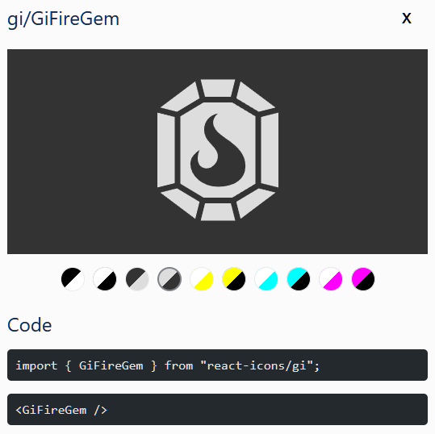
</div>

## User Flow

The user flow shows the planned journey the user can go through, due to time contraints some of this flow could not be implemented at this time.

<div style="text-align:center;">
    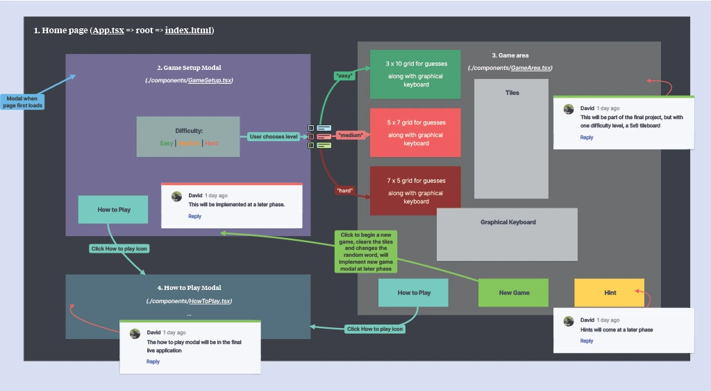
</div>

## Wireframes

The wireframes show how the game should look on various device sizes, mobile, tablet and desktop.

<div style="text-align:center;">
    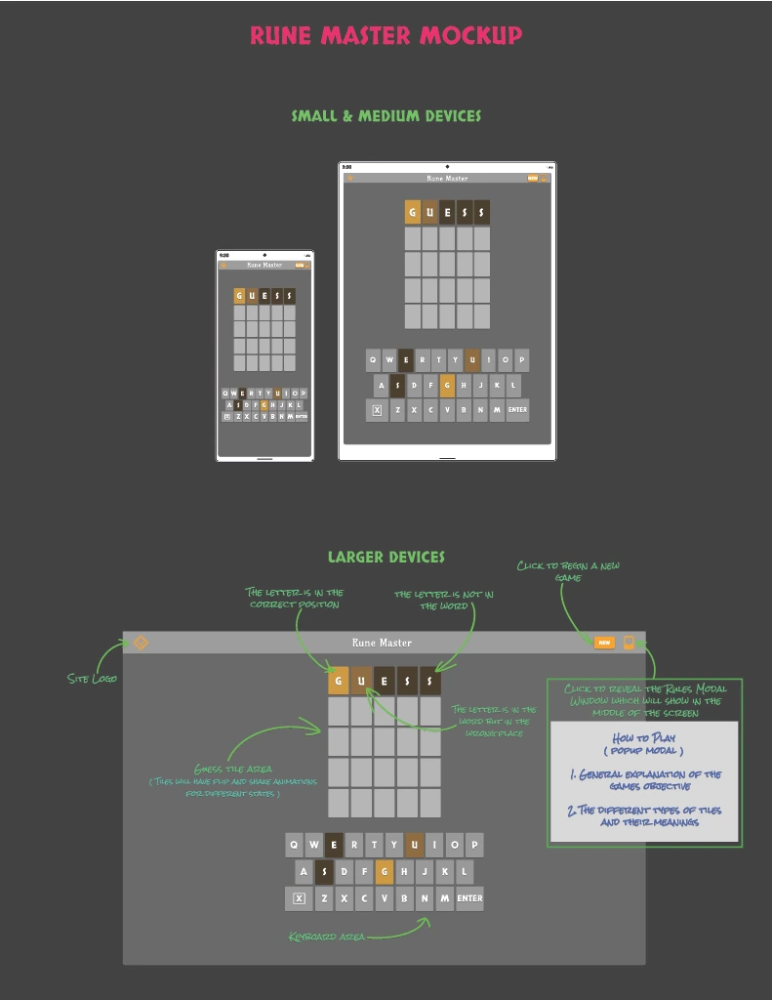
</div>

---
# <u>Testing</u>

### Manual Testing

[**UAT Test Script**](/documentation/testing/uat/manual-uat.md)

#### WAVE Accessibility Testing

**Initial Failed Test**

<div style="text-align:center;">
    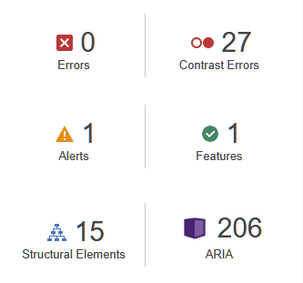
</div>

**Final Passed Test**

<div style="text-align:center;">
    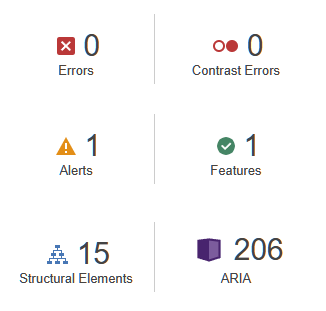
</div>

#### Lighthouse Performance Testing

**Initial Test**

<div style="text-align:center;">
    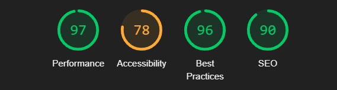
</div>

**Final Test**

<div style="text-align:center;">
    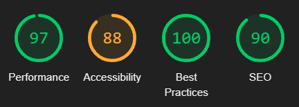
</div>

**Performance Metrics**

<div style="text-align:center;">
    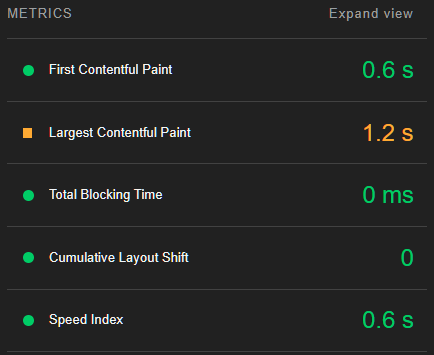
</div>

#### HTML Validation

**Validated HTML Code**

<div style="text-align:center;">
    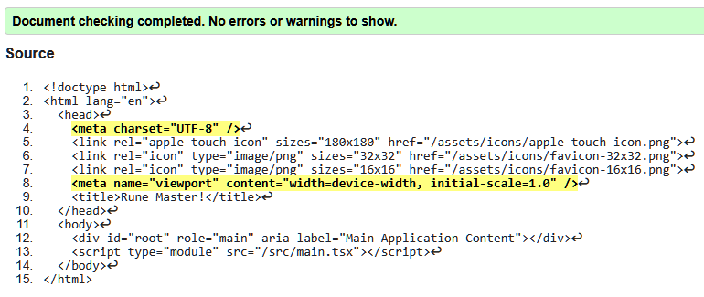
</div>

#### CSS Validation

**Validated CSS Code**

<div style="text-align:center;">
    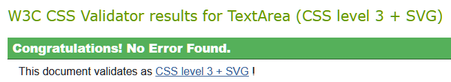
</div>

#### ESLint script testing
Due to using react and typescript I opted for ESLint instead of JSHint for a more in depth analysis of my scripts code. I ran these tests and had the results written to a json file.

**Initial ESLint Report**<br>
In the initial report you will notice most or all of the errors relate to react scope, This is related to the ESLint configuration (or the version of React) expects import React from "react"; at the top of every file that uses JSX.

If you omit this import, ESLint will complain, even if your code works with React 17+ (which no longer requires this import due to the new JSX/TSX transform).

So to fix this, and prevent it picking up this deprecated error, I added the following rules to the eslint.config.js file.

```
  {
    rules: {
      "react/react-in-jsx-scope": "off"
    }
  }
```

[**ESLint - Initial Report**](/documentation/testing/ESLint/initial-eslint-results.json)

If you observe in the final ESLint report, there are no errors remaining.

[**ESLint - Final Report**](/documentation/testing/ESLint/final-eslint-results.json)

### Automated Testing

[**Vitest - Automated Testing**](/documentation/testing/automation/vitest-results.json)

## Issues, Fixes & Future Features

### Issues Fixed
- Contrast Issues for the tiles and keyboard
- Link to manifest removed from index.html as this is redundant and was throwing console errors
- Background tile images moved from inline styles to index.css due to issues rendering in deployment
- Accessibility issues fixed with aria attributes, still room for improvement
- Some issues with keyboard fonts
- Issue where background images of certain tiles and keyboard tiles wouldn't display
- Similar background image issue as above where images were fine in test environment, but wouldn't show in deployment
- React scope issues picked up in ESLint testing

### Issues still present
- As mentioned above accessibility could be improved further
- Tailwind class declarations could be neater
- Due to time, certain features will be introduced at a later date - as stated in Future Features
- Git Commit messages could be optimised in future, this is still a skill i am working on
- When testing on an old monitor i have noticed the GitHub link at the bottom goes off the page, but doesn't happen on more modern monitors / resolutions, didn't find a quick enough fix in time
- Local Storage caching was implemented, it was working fine, but commented it out (deactivated it) as in its basic state wasn't much use to the user, I have left this in the code with a view of making it more robust in the future and reactivating it

### Future Features
- **Ability to earn and view Achievements**
- **Hints for the solution**
- **More refined local storage usage to allow game to be saved**
- **Leader board to allow users to view others guess accuracy and speed**
- **Share button to share to social media**
- **Head to head, 2 players online able to play the same game, the person to guess first wins**
- **Utilising Local storage better to assist in some of the above features as well as the ability to save games**
- **Email opt in and contact form**
- **A 404 page and more robust toasts for user guidance and support**

---
# <u>Deployment</u>

#### GitHub Profile

[**Dave-MK - Overview**](http://github.com/dave-mk)

My GitHub profile

#### GitHub Repo

A link to the entire Rune Master repository

[**MP2 Rune Master - Repo Overview**](http://github.com/dave-mk/mp2-rune-master)

#### GitHub Project Page

[**MP2-Rune-Master Project**](https://github.com/users/Dave-MK/projects/4/views/1)

The project management page for Rune Master 

#### Live Site (GitHub Pages)

[**Rune Master**](https://dave-mk.github.io/mp2-rune-master)

A word game - guess the correct runes within six attempts and become the Rune Master!

## Acknowledgements

**Miguel Ortega Legorreta** - My college tutor for his understanding, support and guidance during this project

[Vite React Setup Documentation](https://vite.dev/guide/#scaffolding-your-first-vite-project) - For ReactJS + TypeScript setup using Vite

[Josh Teaches Code](https://www.youtube.com/watch?v=qT33aMpQFC8&t=13242s) - His video taught me how to implement the core functionality

[Semi Circle Youtube](https://www.youtube.com/watch?v=1CN7C6u31zA) - His video taught me how to create modal components

[TypeScript Documentation](https://www.typescriptlang.org/docs/) - I used this documentation to understand TypeScript

[Tailwind CSS Setup Documentation](https://tailwindcss.com/docs/installation/using-vite) - For setting up and understanding the utility classes used for this project

[Vitest Setup Documentation](https://vitest.dev/guide/#adding-vitest-to-your-project) - Learning about and setting up Vitest, as well as executing the testing

[Official Wordle Game - NYTimes](https://www.nytimes.com/games/wordle/index.html) - I was inspired by the Wordle game on NYTimes website

[FreeConvert png to webp](https://www.freeconvert.com/png-to-webp) - For converting the pngs used in the game to webp format to improve performance

[Adobe Firefly](https://firefly.adobe.com/) - Adobe Firefly for the amazing AI text-to-image generation - a real time saver

[Coolors.co](https://coolors.co/) - Coolors to generate the colour palette for the site

